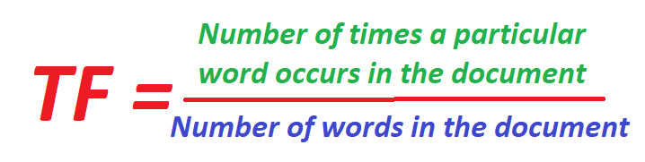
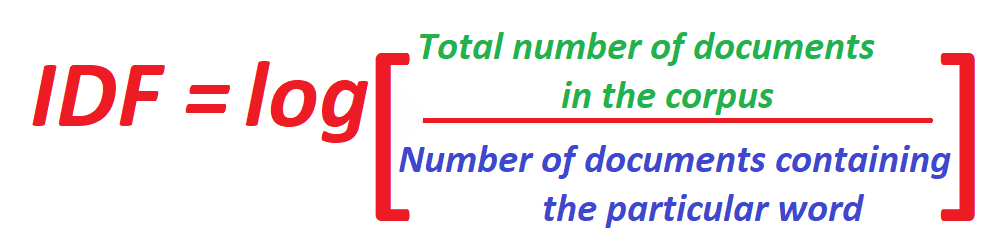
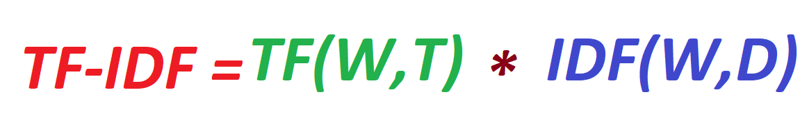

# T-Shirt Recommendation System

In this blog I will take you through some important concepts on which the whole T-shirt Recommendation System is built.

I learnt to make this system back in summer by following the Introductory course by [Applied AI Course](https://www.appliedaicourse.com/)

The course is awesome and it takes you from the basic concepts like Linear Algebra to some very good concepts like bag of words and TF-IDF used in Machine Learning.

The basic libraries used in making of this system are :

1] scikit learn <br/>
2] pandas <br/>
3] numpy <br/>
4] matplotlib <br/>
5] keras

The following steps make up the whole system :

1] Data Cleaning. <br/>
2] Creating a bag of words and finding Euledian Distance between every title <br/>
3] Creating a TF-IDF system and then finding Eucledian Distance between every title <br/>
4] Using the VGG16 pre-trained Neural Network to do image comparison and then applying the Eucledian distance method. <br/>
5] Finally merging all the above methods and giving weights to all of the above methods and finding the best solution.


<p align="middle"></p>

**I will be explaining :**

1] A bit of Data Cleaning. <br/>
2] Bag of Words(BoW). <br/>
3] Text-Frequency(TF). <br/>
4] Inverse Document Frequency(IDF). <br/>

**scikit learn is used to make the above concepts to come into action**

### Data Cleaning and Formatting :

The main thing that matters the most in Machine Learning is the data that you have.<br/>
If you have a good amount of data that is useful for the problem that you are solving then your system is surely to produce better results.<br/>
We do all of this data formatting and preprocessing using the **pandas** library in python.

The first step is to get the data of T-shirts and storing it into a pandas data-frame.<br/>
We get this data from Amazon's API Service.<br/>
You can get the data file by clicking on this [link](https://drive.google.com/file/d/0BwNkduBnePt2LTRsVEg1WjJiSFk/view?usp=sharing).<br/
It is a json file and you can store it in a data-frame using the following code :

```python

data = pd.read_json('tops_fashion.json')

```
Here pd refers to pandas which we imported in the beginning as pd.<br/>

You can now find the shape of all the data points and variables using the following code :

```python

print ('Number of data points : ', data.shape[0], \
       'Number of features/variables:', data.shape[1])
       
```

The output will be :
```diff
-Number of data points :  183138 
-Number of features/variables: 19
```

The further steps are all about cleaning the data. As this blog does not focus that much on data cleaning and formatting and mainly focuses on the concepts used in recommendation systems, I am going to skip all these steps and jump to the main part.<br/>

The preprocessed data is avvailable on my github repository inside the visual similarity folder.<br/>
The file in named as **16k_preprocessed_data**<br/>
Though here are a few things you need to know before skipping to the main part of the system.<br/><br/>
After all the prepreocessing thats been done you have the following features left in the dataset :<br/>

1. asin
2. brand
3. color
4. image url
5. product type
6. title
7. price

The number of data points remaining after reducing the data from 180k to 16k is : 16042

Now we are good to go.

## Similarity based on Text Comparison :

The first thing is storing the preprocessed data in a pandas data-frame :

```python
data = pd.read_pickle('pickels/16k_apperal_data_preprocessed')
```

### BAG OF WORDS (BoW):

Bag of Words is a way of representing data. It is used in Natural Language Processing and Information Retrieval. In this method a large document or even a short sentence can be represented as a multiset. This data can be considered to be the contents of a bag, hence the term "BAG OF WORDS".

<p align="middle"></p>


So what we do now is convert all of the titles available with us into a n-dimensional set which is the bag of words. The bag of words that we create will contain all unique words from all titles.

### Code for BoW :

```python
def bag_of_words_model(doc_id, num_results):
    # doc_id: apparel's id in given corpus
    
    # pairwise_dist will store the distance from given input apparel to all remaining apparels
    # http://scikit-learn.org/stable/modules/metrics.html#cosine-similarity
    pairwise_dist = pairwise_distances(title_features,title_features[doc_id])
    
    # np.argsort will return indices of the smallest distances
    indices = np.argsort(pairwise_dist.flatten())[0:num_results]
    #pdists will store the smallest distances
    pdists  = np.sort(pairwise_dist.flatten())[0:num_results]

    #data frame indices of the 9 smallest distace's
    df_indices = list(data.index[indices])
    
    for i in range(0,len(indices)):
        # we will pass 1. doc_id, 2. title1, 3. title2, url, model
        get_result(indices[i],data['title'].loc[df_indices[0]], data['title'].loc[df_indices[i]], data['medium_image_url'].loc[df_indices[i]], 'bag_of_words')
        print('ASIN :',data['asin'].loc[df_indices[i]])
        print ('Brand:', data['brand'].loc[df_indices[i]])
        print ('Title:', data['title'].loc[df_indices[i]])
        print ('Euclidean similarity with the query image :', pdists[i])
        print('='*60)


bag_of_words_model(12566, 20) 


```

### Term Frequency (TF) :

The number of times a particualr word (term) occurs in a text or sentence is called as the **Term Frequency**. This type of representation tells us how important a word is in a document. It is normally used as a weighing factor, that is, it gives weight to a particular word.

The term frequency increases as the frequency of the word in the document increases and decreases with the increase in the size of the document.

The Term Frequency (TF) can be given as follows :
<p align="middle"></p>

### Inverse Document Frequency (IDF) :

This is also a method of measuring the frequency of a word but is a little different from Term Frequency (TF). Instead of taking the word and the document into consideration, IDF takes the word and the whole Document Corpus (collection of all documents).

In this type of representation, the less the frquency of the word occuring in the corpus, the more will be the value of IDF.

IDF is given by :
<p align="middle"></p>

### TF-IDF :

TF-IDF of a word is the frequency of a particular word claculated using both the TF and the IDF methods.

The formula for Calculating the TF-IDF of a particular word is :

<p align="middle"></p>

Here :

W = The word whose TF-IDF we want to calculate.<br>
T = The length of the Text in which the word is present. <br>
D = The length of the whole Document Corpus.<br>


### Code for TF-IDF

```python
tfidf_title_vectorizer = TfidfVectorizer(min_df = 0)
tfidf_title_features = tfidf_title_vectorizer.fit_transform(data['title'])
# tfidf_title_features.shape = #data_points * #words_in_corpus
# CountVectorizer().fit_transform(courpus) returns the a sparase matrix of dimensions #data_points * #words_in_corpus
# tfidf_title_features[doc_id, index_of_word_in_corpus] = tfidf values of the word in given doc
```

```python
def tfidf_model(doc_id, num_results):
    # doc_id: apparel's id in given corpus
    
    # pairwise_dist will store the distance from given input apparel to all remaining apparels
    # http://scikit-learn.org/stable/modules/metrics.html#cosine-similarity
    pairwise_dist = pairwise_distances(tfidf_title_features,tfidf_title_features[doc_id])

    # np.argsort will return indices of 9 smallest distances
    indices = np.argsort(pairwise_dist.flatten())[0:num_results]
    #pdists will store the 9 smallest distances
    pdists  = np.sort(pairwise_dist.flatten())[0:num_results]

    #data frame indices of the 9 smallest distace's
    df_indices = list(data.index[indices])

    for i in range(0,len(indices)):
        get_result(indices[i], data['title'].loc[df_indices[0]], data['title'].loc[df_indices[i]], data['medium_image_url'].loc[df_indices[i]], 'tfidf')
        print('ASIN :',data['asin'].loc[df_indices[i]])
        print('BRAND :',data['brand'].loc[df_indices[i]])
        print ('Eucliden distance from the given image :', pdists[i])
        print('='*125)
tfidf_model(12566, 20)

```

#### Thank You for referencing my blog. Contact me for any issues on --> yeole.tanay212@gmail.com

<p align="middle"> THANK YOU </p>
